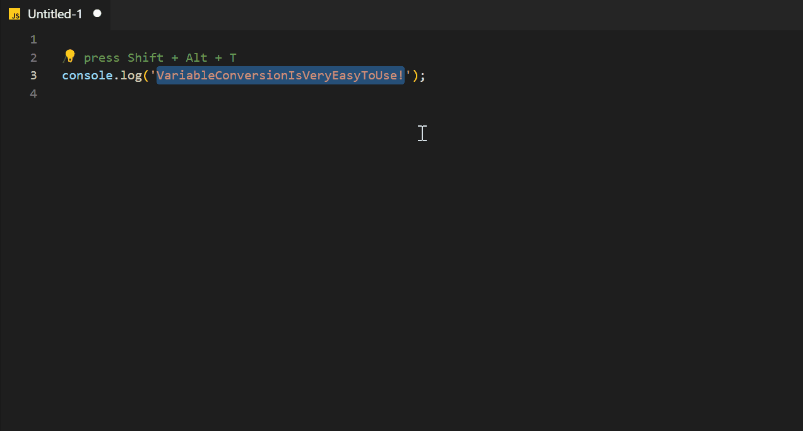
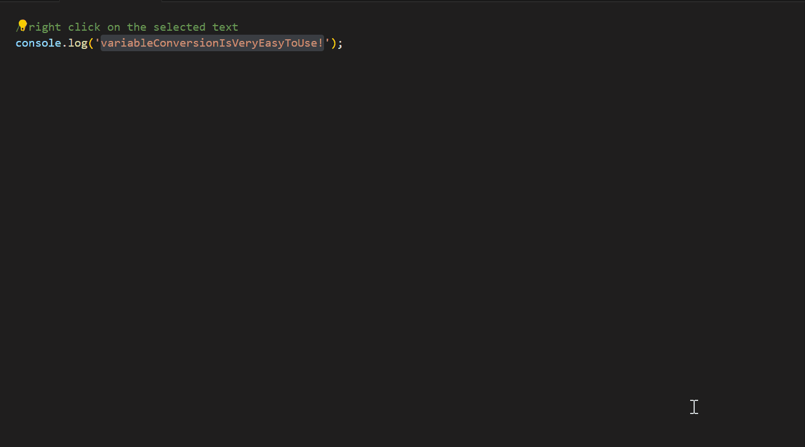

# 命名方式转换插件 Variable Conversion

一个强大的变量名转换插件，支持常用命名方式间一键转换，支持右键菜单、快捷键、底栏等多种方式使用。 
A powerful variable naming conversion extension. You can use it through the editer menu, shortcut keys and bottom bar.

## 如何使用？ How to Use?

> 🔭 Tips for Chinese users: 如果您无法看到下文图片，请[点击这里查看](https://gitee.com/coder-xiaomo/variable-conversion-vscode-extension/blob/main/README.md)

#### 1. 选中代码中需要转换的内容  Select The Text To Convert

> Tips: 
> 可以通过 `Ctrl + D` 快捷键选中光标所在的单词 
> You can press `Ctrl + D` to select the word near the cursor

#### 2. 按 `Shift + Alt + T`  Press `Shift + Alt + T`

或者右键 -> 将字符串转换为...  Or right-click on the selected text -> Convert string to...

选择转换目标，转换完成

## 反馈 Feedback

如果您觉得本插件还不够好用，有更好的使用建议；或者发现了 BUG，欢迎[前往 GitHub 仓库提 issue](https://github.com/coder-xiaomo/variable-conversion-vscode-extension/issues). 使用简体中文、繁體中文或 English 均可，不建议使用翻译软件翻译，否则可能会让文字描述变得抽象难懂。 
If you feel that this extension is not good to use, or you have a better use suggestion, or found a BUG, welcome to [create an issue on GitHub](https://github.com/coder-xiaomo/variable-conversion-vscode-extension/issues). English, 简体中文 or 繁體中文 are all supported, it is not recommended to use translation software, otherwise it may make the text description become abstract and difficult to understand.

## 开源共建 OpenSource & Contribute

本插件已开源(MIT License)，欢迎提 Pr 共建，让插件变得更好用！ 
This plug-in has been open source (MIT License), welcome to Pr co-construction, let the plug-in become better!

GitHub Repo (开源地址): https://github.com/coder-xiaomo/variable-conversion-vscode-extension.git

Gitee Mirror (码云镜像): https://gitee.com/coder-xiaomo/variable-conversion-vscode-extension.git

<!--

## Extension Settings

Include if your extension adds any VS Code settings through the `contributes.configuration` extension point.

For example:

This extension contributes the following settings:

* `myExtension.enable`: Enable/disable this extension.
* `myExtension.thing`: Set to `blah` to do something.

-->

**Enjoy!**
